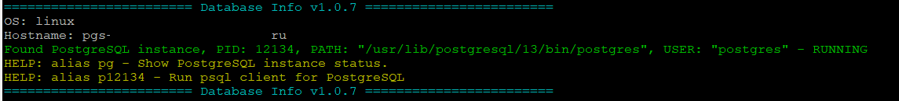
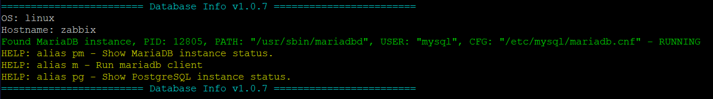
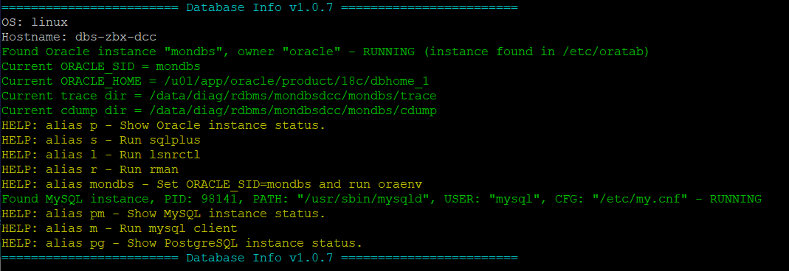

# Сценарий на Bash для вывода информации о состоянии разных СУБД при входе на сервер.

Пример вывода информации при входе в консоль:

## Установка скрипта на сервер с Linux:

*1. Зайти на сервер под нужной УЗ (для Oracle RDBMS это УЗ oracle), в файл .bash_profile (.profile) прописать:*

~~~~
# Source DBS definitions
[ -r ~/.bashrc_dbs ] && source ~/.bashrc_dbs
~~~~

*2. Скопировать скрипт .bashrc_dbs на сервер в домашний каталог нужной УЗ (для Oracle RDBMS это обычно /home/oracle).*

*3. При следующем входе под нужной УЗ должна будет выводится информация о состоянии инстансов СУБД и создаваться нужные короткие алиасы.*

## Установка скрипта на сервер с AIX:

*1. Зайти на сервер под нужной УЗ (для Oracle RDBMS это УЗ oracle), в файл .bashrc прописать:*

~~~~
# Source DBS definitions
[ -r ~/.bashrc_dbs ] && source ~/.bashrc_dbs
~~~~

*2. Скопировать скрипт .bashrc_dbs на сервер в домашний каталог нужной УЗ (для Oracle RDBMS это обычно /home/oracle).*

*3. При следующем входе под нужной УЗ должна будет выводится информация о состоянии инстансов СУБД и создаваться нужные короткие алиасы.*

### Опционально: Дополнительная настройка чтобы использовать возможности коротких alias для доступа в PostgreSQL из под текущего пользователя

*1. В файл /etc/sudoers.d/dbs добавить:*

Заменить ниже myuserlogin на логин нужной УЗ, под которой должено выводиться состояние СУБД при входе.

~~~~
myuserlogin ALL=(postgres) NOPASSWD: /usr/lib/postgresql/12/bin/psql
~~~~

или

~~~~
myuserlogin ALL=(postgres) NOPASSWD: /usr/lib/postgresql/14/bin/psql
~~~~

Выставить права и проверить корректность:
~~~~
chmod 440 /etc/sudoers.d/dbs
visudo -c
~~~~

*2. Добавить пользователя myuserlogin в группу postgres:*
~~~~
usermod -a -G postgres myuserlogin
~~~~
