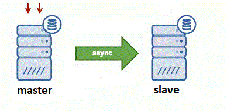

## Скрипты для быстрого создания реплик MySQL с использованием xtrabackup или mariabackup

Автор: Михаил Григорьев <sleuthhound@gmail.com>

### Cоздание MASTER-SLAVE реплики c GTID (в автоматическом режиме)



На MASTER создаем пользователя для репликации:
```
CREATE USER 'replica'@'%' IDENTIFIED WITH mysql_native_password BY 'XXXXX';
GRANT REPLICATION SLAVE ON *.* TO 'replica'@'%';
FLUSH PRIVILEGES;
```

**ВАЖНО!** Для передачи резервной копии с MASTER на SLAVE используется протокол TCP и порт 9999, который открывается на приемнике - там где будет запускаться скрипт xtrabackup_reciver.sh. Поэтому позаботьтесь о том, чтобы этот порт бул открыт для входящих соединений на межсетевом экране, либо укажите другой порт через опцию -p

На MASTER отредактируйте файл xtrabackup_sender.conf, как правило, нужно только указать пароль пользователя root в опции XTRABACKUP_ADDITIONS_OPTS или MARIABACKUP_ADDITIONS_OPTS

На SLAVE отредактируйте файл настроек xtrabackup_reciver.conf под свои задачи, в текужем виде он настроен на автоматическое восстановление и создание реплики, за это отвечают опции:

```
# Full restore backup (prepare and move), old mysql data delete!
FULL_RESTORE_BACKUP=1
# Stoping MySQL before recive backup
STOP_MYSQL_BEFORE=1
# Delete MySQL data before recive backup
DELETE_MYSQL_DATA_BEFORE=1
# Run replication
RUN_REPLICATION=1
```

Так же в этом файле прописаны адрес текущего мастера (MYSQL_MASTER_HOST), имя пользователя для репликации и его пароль - укажите свои.

Так же скорректируйте версию xtrabackup в параметре PERCONA_XTRABACKUP_VER

В xtrabackup_reciver.conf так же обратите внимание на опции

```
MYSQL_DATA_DIR=/var/lib/mysql
MYSQL_BINLOG_DIR=/var/lib/mysql-bin
```

они указывают основной каталог MySQL, а так же каталог бинарных логов. По умолчанию в большинстве ОС их не нужно изменять, но если у Вас данные MySQL находятся на отдельном диске в нестандартном месте, например в каталоге /data/mysql, то поменяйте эти опции. Если бинарные логи при этот находятся в том же каталоге, что и данные, то опцию MYSQL_BINLOG_DIR можно оставить пустой без указания пути.

Далее на будущем SLAVE запускаем скрипт-приемник (в screen), очень важно чтобы на диске куда будет писаться временный бэкап (/var/lib/mysql_backup - можете поменять на свой путь) было достаточно места:
```
mkdir /var/lib/mysql_backup
./xtrabackup_reciver.sh -m percona -d /var/lib/mysql_backup
```

Опция -m percona указывает использовать percona xtrabackup

На MASTER запускаем скрипт-передатчик (в screen):
```
./xtrabackup_sender.sh -m percona -a mysql-db01.mysite.ru
```

Опция -m percona указывает использовать percona xtrabackup

Опция -a указывать IP адрес или DNS имя сервера где был запущен скрипт xtrabackup_reciver.sh

После передачи всех данных с MASTER, на будущий SLAVE запустится процесс подготовки скопированного бэкапы, его перемещение в каталог MySQL data, настройка репликации и ее запуск.

Лог процесса ведется в файле xtrabackup_reciver.log

### Полезные команды

Смотрим как идет репликация:
```
SHOW SLAVE STATUS\G
```

Если нужно приостановить репликацию:
```
STOP SLAVE;
```

Если нужно удалить репликацию на каком-то SLAVE:
```
STOP SLAVE;
RESET SLAVE;
RESET MASTER;
RESET SLAVE ALL;
```

(с) 2020-2022 by Mikhail Grigorev <sleuthhound@gmail.com>
